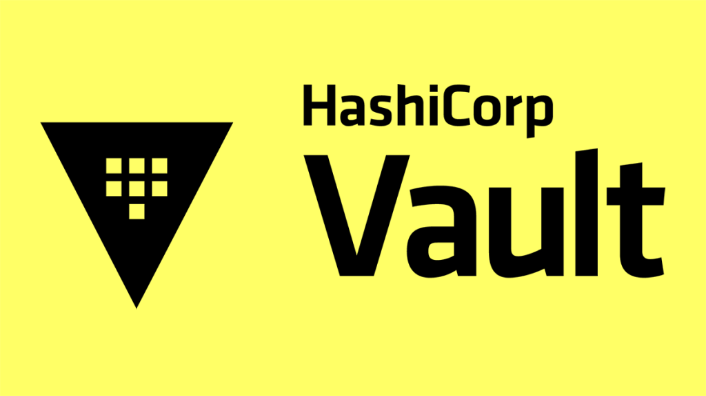

# Vault Secret Management
- This repository contains tools and configurations for managing secrets using HashiCorp Vault. It provides a comprehensive solution for securely storing, accessing, and automating secrets management in your infrastructure.

## Demo projects

All demo projects are available in the [demo-projects](demo-projects) folder.

## Notes

- [1 - aws-access-management-vault-terraform-cloud](https://github.com/aungkohtat/aws-access-management-vault-terraform-cloud/blob/main/README.md)